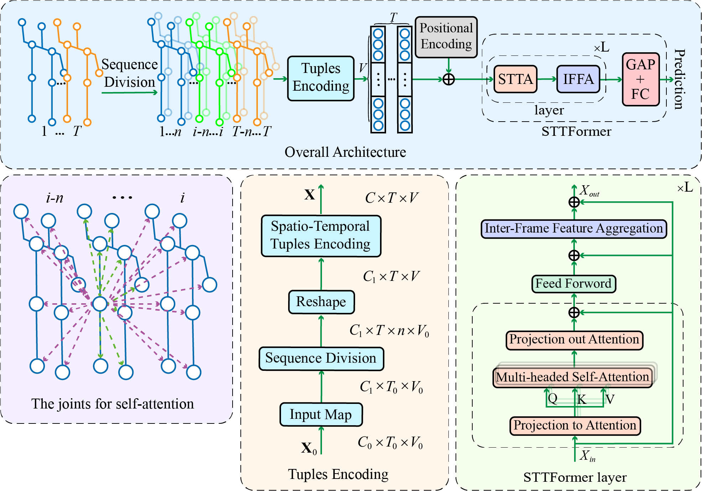

# STTFormer
This repo is the official implementation for [Spatio-Temporal Tuples Transformer for Skeleton-Based Action Recognition](https://arxiv.org/abs/2201.02849).

## Architecture of STTFormer


# Data Preparation

### Download datasets.

#### There are 2 datasets to download:

- NTU RGB+D 60 Skeleton
- NTU RGB+D 120 Skeleton

#### NTU RGB+D 60 and 120

1. Request dataset here: http://rose1.ntu.edu.sg/Datasets/actionRecognition.asp
2. Download the skeleton-only datasets:
   1. `nturgbd_skeletons_s001_to_s017.zip` (NTU RGB+D 60)
   2. `nturgbd_skeletons_s018_to_s032.zip` (NTU RGB+D 120)
   3. Extract above files to `./gendata/nturgbd_raw`

### Data Processing

#### Directory Structure

Put downloaded data into the following directory structure:

```
- gendata/
  - ntu/
  - ntu120/
  - nturgbd_raw/
    - nturgb+d_skeletons/     # from `nturgbd_skeletons_s001_to_s017.zip`
      ...
    - nturgb+d_skeletons120/  # from `nturgbd_skeletons_s018_to_s032.zip`
      ...
```

#### Generating Data

- Generate NTU RGB+D 60 or NTU RGB+D 120 dataset:

```
 cd ./gendata/ntu # or cd ./gendata/ntu120
 # Get skeleton of each performer
 python3 get_raw_skes_data.py
 # Remove the bad skeleton 
 python3 get_raw_denoised_data.py
 # Transform the skeleton to the center of the first frame
 python3 seq_transformation.py
```

# Training & Testing

### Training

- Change the config file depending on what you want.

```
# Example: training STTFormer on NTU RGB+D 60 cross subject
python3 main.py --config config/ntu60_xsub.yaml
```

- To train model on NTU RGB+D 60/120 with bone or motion modalities, setting `bone` or `vel` arguments in the config file or in the command line.

```
# Example: training STTFormer on NTU RGB+D 60 cross subject under bone modality
python3 main.py --config config/ntu60_xsub.yaml --train_feeder_args bone=True --test_feeder_args bone=True --work_dir ./work_dir/ntu60/xsub_bone
```

### Testing

- To test the trained models saved in <work_dir>, run the following command:

```
python3 main.py --config <work_dir>/config.yaml --work_dir <work_dir> --run_mode test --save_score True --weights <work_dir>/xxx.pt
```

- To ensemble the results of different modalities, run 
```
# Example: ensemble three modalities of STTFormer on NTU RGB+D 60 cross subject
python3 ensemble.py --dataset ntu/xsub --joint_dir work_dir/ntu60/xsub_joint --bone_dir work_dir/ntu60/xsub_bone --joint_motion_dir work_dir/ntu60/xsub_joint_motion
```

### Pretrained Models

- The pretrained models will be available soon.

## Acknowledgements

This repo is based on [CTR-GCN](https://github.com/Uason-Chen/CTR-GCN) and [DSTA-Net](https://github.com/lshiwjx/DSTA-Net). Thanks to the original authors for their work!

# Citation

Please cite this work if you find it useful:.

      @article{Qiu2022SpatioTemporalTT,
        title={Spatio-Temporal Tuples Transformer for Skeleton-Based Action Recognition},
        author={Helei Qiu and Biao Hou and Bo Ren and Xiaohua Zhang},
        journal={ArXiv},
        year={2022},
        volume={abs/2201.02849}
      }